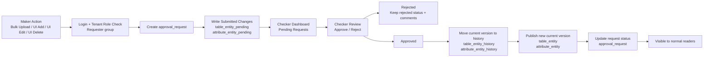
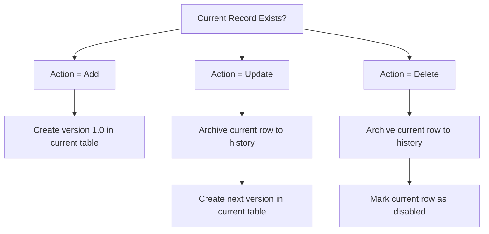

# Data Dictionary Maker-Checker Business Flow Diagram

## 1. Purpose

This page shows the maker-checker flow from a business and operational point of view rather than only the physical table relationships.

It is intended for review with:

- backend developers
- frontend developers
- product / BA
- reviewers / approvers

## 2. End-to-End Business Flow



## 3. Table-by-Stage Mapping

| Stage | Business Meaning | Main Tables |
| --- | --- | --- |
| Current published catalog | What users see today | `table_entity`, `attribute_entity` |
| Submission header | One maker submission / request | `approval_request` |
| Pending review | Submitted changes waiting for checker | `table_entity_pending`, `attribute_entity_pending` |
| Approved previous versions | Closed versions after publish | `table_entity_history`, `attribute_entity_history` |
| Tenant access control | Who can submit / approve | `tenant_role_mapping` |

## 4. Business View by Actor

### Maker

- logs in only when attempting a mutating action
- must belong to the tenant requester group
- submits change request
- sees own submitted requests and status

### Checker

- logs in when opening review actions
- must belong to the tenant approver group
- reviews pending requests
- approves or rejects with comments

### Reader / Normal User

- sees current approved records only
- does not see pending data as published catalog content

## 5. Publish Logic View



## 6. Straightforward Review Summary

```text
Maker submits change
  -> approval_request created
  -> pending tables receive submitted rows
  -> checker reviews request
  -> if rejected: request stays rejected with comments
  -> if approved:
       current old version moves to history
       new version becomes current published record
       readers see updated data
```

## 7. Review Questions

Use these during walkthrough:

1. Does every mutating action go through `approval_request` first?
2. Are pending rows clearly separated from published rows?
3. On approval, do we always preserve previous approved data in history?
4. On rejection, do we avoid changing current published data?
5. Is tenant-level role mapping sufficient for requester / approver control?
