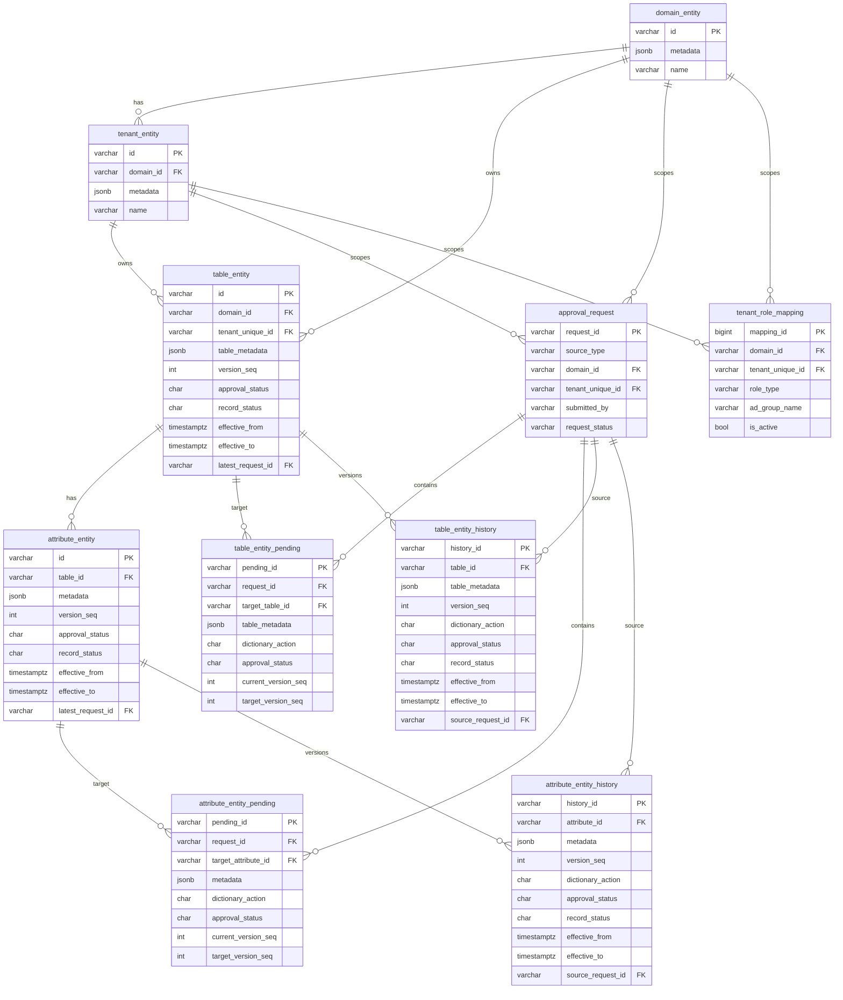

# Data Dictionary Maker-Checker Table Relationship Diagram

## 1. Scope

This diagram reflects the current target schema after the maker-checker migration design:

- existing current-state tables
- new request / pending / history tables
- tenant-level role mapping

Note:

- `table_entity` is the current service table that represents `dataset`
- `attribute_entity` represents dataset attributes / fields

## 2. High-Level ER Diagram



## 3. Simplified Review View

```text
domain_entity
  └── tenant_entity
        ├── table_entity (current approved dataset)
        │     ├── attribute_entity (current approved attributes)
        │     ├── table_entity_pending (submitted dataset changes)
        │     └── table_entity_history (approved old versions)
        │
        └── approval_request
              ├── table_entity_pending
              └── attribute_entity_pending

attribute_entity
  ├── attribute_entity_pending (submitted attribute changes)
  └── attribute_entity_history (approved old versions)

tenant_role_mapping
  └── defines REQUESTER / APPROVER / VIEWER groups per tenant
```

## 4. Lifecycle Mapping

### Current published records

- `table_entity`
- `attribute_entity`

These are the records shown to normal users after approval.

### Submitted but not yet approved

- `approval_request`
- `table_entity_pending`
- `attribute_entity_pending`

These hold maker submissions waiting for checker action.

### Approved historical versions

- `table_entity_history`
- `attribute_entity_history`

These hold closed versions after a new version is approved and released.

### Access control

- `tenant_role_mapping`

This maps each tenant to AD groups for requester / approver / viewer access.

## 5. Review Notes

When reviewing this with the team, the main things to confirm are:

- `table_entity` continues to represent `dataset`
- `attribute_entity` remains the child table of `table_entity`
- new changes do not go directly into current tables first; they go into `*_pending`
- history tables store approved previous versions only
- `approval_request` is the parent request record for both dataset-level and attribute-level submissions
- `tenant_role_mapping` is tenant-scoped, not global
