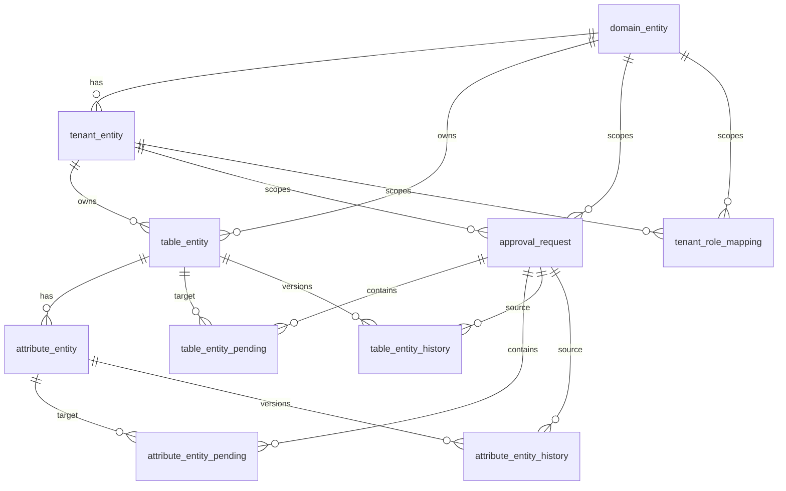

# Data Dictionary Maker-Checker Table Relationship Diagram

## Purpose

This page provides a simple review-friendly view of the current target table relationships for the maker-checker enhancement.

Important note:

- `table_entity` in the current service is the `dataset` table in the requirement wording.
- `attribute_entity` is the child table that stores dataset attributes / fields.

## Entity Groups

| Group | Tables | Purpose |
| --- | --- | --- |
| Current published data | `domain_entity`, `tenant_entity`, `table_entity`, `attribute_entity` | Existing live catalog data shown to users |
| Access control | `tenant_role_mapping` | Maps tenant-level requester / approver / viewer AD groups |
| Request management | `approval_request` | Parent request record for maker submissions |
| Pending review data | `table_entity_pending`, `attribute_entity_pending` | Submitted changes waiting for checker review |
| Version history | `table_entity_history`, `attribute_entity_history` | Approved previous versions after release |

## High-Level Relationship Diagram



## Simplified Tree View

```text
domain_entity
  └── tenant_entity
        ├── table_entity
        │     ├── attribute_entity
        │     ├── table_entity_pending
        │     └── table_entity_history
        │
        ├── approval_request
        │     ├── table_entity_pending
        │     └── attribute_entity_pending
        │
        └── tenant_role_mapping

attribute_entity
  ├── attribute_entity_pending
  └── attribute_entity_history
```

## Table Intent

### Current tables

- `table_entity`: current approved dataset rows
- `attribute_entity`: current approved attribute rows

### Pending tables

- `table_entity_pending`: submitted dataset-level changes
- `attribute_entity_pending`: submitted attribute-level changes

### History tables

- `table_entity_history`: approved historical dataset versions
- `attribute_entity_history`: approved historical attribute versions

### Request table

- `approval_request`: the request header that groups one maker submission

### Role table

- `tenant_role_mapping`: tenant-scoped access control mapping for requester / approver / viewer groups

## Review Checklist

Please confirm the following during review:

1. `table_entity` remains the physical representation of `dataset`
2. new changes are submitted to pending tables first, not directly to current tables
3. history tables keep approved previous versions only
4. `approval_request` is the parent record for both UI and bulk-upload submissions
5. role mapping is tenant-level, not global
